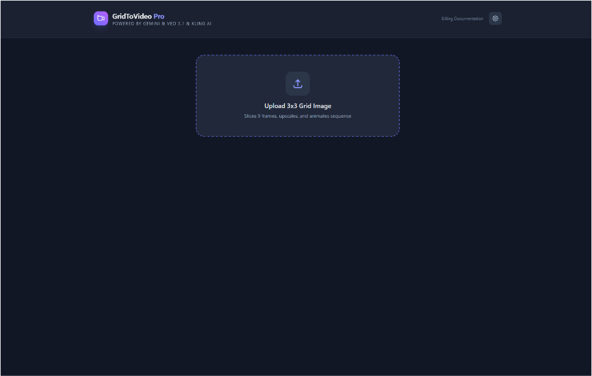

<div align="center">

</div>

# Alcove Pro

**Transform static 3x3 grid images into dynamic, cinematic video sequences using AI.**

Powered by **Gemini 1.5 Pro**, **Veo 3.1**, and **Kling AI**, this application automates the process of slicing grid images, upscaling them to HD, and generating smooth video transitions between frames.

## ✨ Features

- **Multi-Provider Support**: Choose between **Google's Veo 3.1** or **Kling AI** for video generation.
- **Auto-Slicing**: Automatically detects and slices 3x3 grid layouts into individual frames.
- **HD Upscaling**: 
  - **Gemini 3 Pro**: Quick and high quality.
  - **Local Stable Diffusion**: Control via A1111 WebUI (Extras or Img2Img).
  - **ComfyUI**: Use "SeedVR2 Video Upscaler" workflow locally.
- **Smart Settings**: Configure your API keys and provider preferences directly in the UI.
- **Workflow Control**: Manual control over each step (Slice -> Upscale -> Generate Video).
- **CORS Proxy**: Built-in development proxy for seamless API access.

## 🚀 Run Locally

**Prerequisites:** Node.js 18+

1.  **Install dependencies:**
    ```bash
    npm install
    ```

2.  **Configure API Keys:**
    - Create a `.env.local` file (optional, or use the UI Settings):
      ```env
      GEMINI_API_KEY=your_key_here
      ```
    - OR launch the app and use the Settings menu (Gear Icon) to enter your keys reliably.

3.  **Run the app:**
    ```bash
    npm run dev
    ```

4.  **Open in Browser:**
    Navigate to `http://localhost:3000` (Note: Port 3000 is default).

## 🎮 Upscaling Options

### 1. Google Gemini 3 Pro
Default option. Requires a standard Gemini API key.

### 2. Local ComfyUI (Recommended for high quality)
1.  Ensure **ComfyUI** is running locally on port **8188** (`127.0.0.1:8188`).
2.  Go to **Settings** in Alcove Pro.
3.  Change **Image Upscaling Method** to "ComfyUI".
4.  The app uses a built-in workflow ("SeedVR2 Video Upscaler").

### 3. Local Stable Diffusion
1.  Ensure **Automatic1111 WebUI** is running locally.
2.  Enable the API flag: `COMMANDLINE_ARGS=--api`.
3.  Go to **Settings**, select "Local Stable Diffusion".
4.  Choose "Upscaler (Extras)" or "Img2Img".

## 🛠️ Configuration

Click the **Settings (⚙️)** icon in the top right to:
- Switch between **Gemini (Veo)** and **Kling AI** backends for video transitions.
- Choose your **Upscaling Provider** (Gemini, Stable Diffusion, or ComfyUI).
- Enter/Update your API Keys.

> **Note**: Keys entered in the UI are stored securely in your browser's `localStorage`.

---
*Built with React, Vite, and TailwindCSS.*

## 📜 Release Notes (v1.0.0)

### **Alcove Pro Rebrand**
- Renamed project to **Alcove Pro** to reflect its evolution into a comprehensive media suite.

### **New Features**
- **Unified Media Gallery**: All generated assets (videos, stitched sequences, Z-Images) are now organized in a central Gallery with improved aspect ratio support.
- **Global Prompt Library**: Save and manage your favorite prompts across TurboWan and Z-Image. Prompts are synced in real-time.
- **Z-Image Generation**: Create high-quality AI images directly within the app using the new configured ComfyUI workflow.
- **Individual Upscaling**: Dedicated page for upscaling single images using Gemini, ComfyUI, or Local Stable Diffusion.
- **Frame Extraction**: Extract high-quality last frames from videos to use as anchors for new generations.
- **Seamless Handover**: 
    - Send generated Z-Images to Upscale.
    - Send extracted frames to TurboWan.
    - **NEW**: Send upscaled results back to TurboWan to animate them with preserved prompts.

### **Improvements**
- **Reactive UI**: Components now auto-refresh state when interacting with the Prompt Library.
- **Smart Aspect Ratios**: Gallery now intelligently displays media without cropping or squashing, supporting vertical and portrait formats.
- **Enhanced Upscaling**: Added "Animate in TurboWan" button to the upscale results page for immediate workflow continuity.
